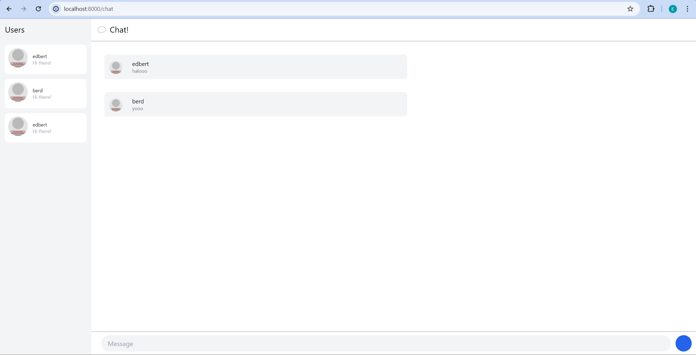
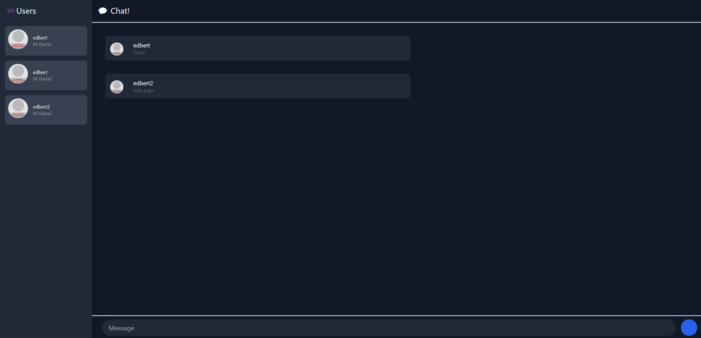

## Original Code

Setelah menjalankan `npm start` pada YewChat dan Simple WebSocket Server, dapat terlihat bahwa YewChat dapat berjalan dengan baik. Kita dapat mengirim pesan dan menerima pesan dari _chat room_.

## 3.2 Add some creativities to the webclient

Mengubah tampilan menjadi darkmode. Mengubah background color menjadi grey